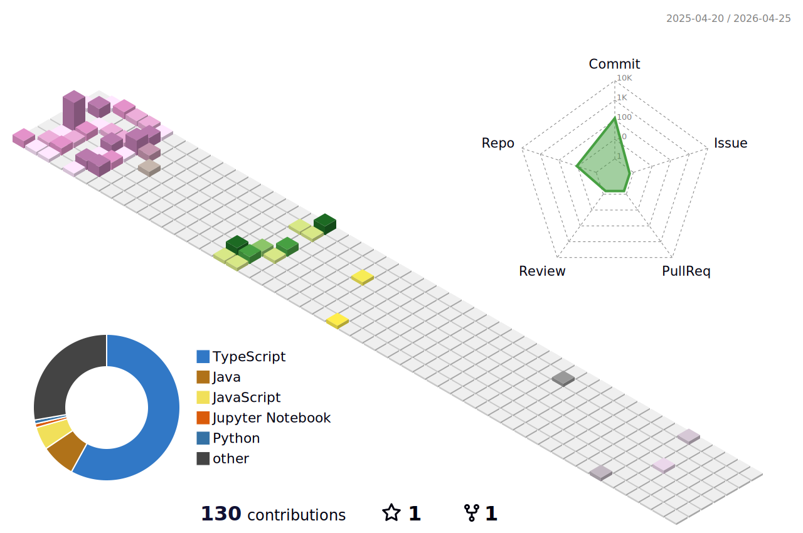

  
  

## 👋 Sobre Mim

Olá! Sou Vyctor, um estudante de 19 anos cursando o terceiro semestre de Análise e Desenvolvimento de Sistemas.

Sou apaixonado por desenvolvimento backend, com experiência em **Java + Spring Boot**, **Node.js (TypeScript)** e **Python**. Também gosto de construir interfaces frontend com **React**, **JavaScript** e **TypeScript**.

Tenho familiaridade com bancos de dados **MySQL**, **PostgreSQL** e **SQLite**, controle de versão com **Git/GitHub**, e conteinerização com **Docker**.

Atualmente, participo ativamente de projetos de extensão acadêmica como instrutor de lógica de programação, Java e Programação Orientada a Objetos, onde compartilho conhecimento e continuo aprimorando minhas habilidades fullstack.

Meu foco é crescer como desenvolvedor de software, aprofundando-me em arquitetura, código limpo e soluções escaláveis. Sempre aprendendo, sempre codando!

---

## 🛠️ Habilidades e Ferramentas

  

---

## 📊 Minhas Estatísticas e Atividades no GitHub

| Produtividade (Horas Comuns de Commit) | Detalhes do Perfil |
| :------------------------------------: | :-----------------------------: |
|  |  |

 

  
  

 

  
  

 

  
  

---

## 🧩 Projetos em Destaque

| Projeto                                                                                                | Descrição                                                                                                                                                                                                                            | Tecnologias                                                        |
| ------------------------------------------------------------------------------------------------------ | ------------------------------------------------------------------------------------------------------------------------------------------------------------------------------------------------------------------------------------ | ------------------------------------------------------------------ |
| [📍 Trace Point - Portal Interativo](https://vyctor-carvalho.github.io/Trace_Point/)                    | Portal interativo e documentação do projeto Trace Point. Apresenta as funcionalidades do sistema de gerenciamento de visitas para a COP-30, detalhando as interações do frontend com a API para diferentes perfis (Visitante, Organizador, Admin). | HTML, CSS, JavaScript                                              |
| [🚀 Fullstack Node](https://github.com/vyctor-carvalho/Full_Stack_Node)                                | Projeto fullstack desenvolvido como teste técnico. Inclui API Node.js + TypeScript e dois frontends em React (Ant Design e Material UI). Utiliza Docker e Docker Compose.                                     | Node.js, TypeScript, React, Ant Design, Material UI, Docker      |
| [📚 Java Book API](https://github.com/vyctor-carvalho/Api-Livros-em-java)                               | Primeiro projeto de API em Java, utilizando Spring Boot e Java 21 para um CRUD de livros com integração a banco de dados.                                                                                     | Java 21, Spring Boot, MySQL                                        |
| [🌍 Angel Visitor API (Backend Trace Point)](https://github.com/vyctor-carvalho/cop30-guide)             | API REST para a COP-30, o backend do projeto Trace Point. Permite que "Anjos" orientem Visitantes, gerenciem presença em eventos e controlem acesso com JWT e permissões baseadas em papéis.                                  | Node.js, TypeScript, PostgreSQL                                    |
| [🐍 Django API ](https://github.com/vyctor-carvalho/Full_Stack_Python)                                 | API construída com Python e Django, usando SQLite e validação JWT customizada. Inclui CRUD completo com login e registro de usuários.                                                                       | Python, Django, SQLite                                             |
| [📊 Itaú Statistics API](https://github.com/vyctor-carvalho/Api-Transacoes-Itau)                          | API REST para um desafio técnico, lidando com estatísticas e controle de transações. Apresenta endpoints para POST/DELETE e GET de transações no último minuto. Utiliza Docker.                                   | Java, Spring Boot, Docker                                          |

---

## 📫 Contato

 
  
  
  

