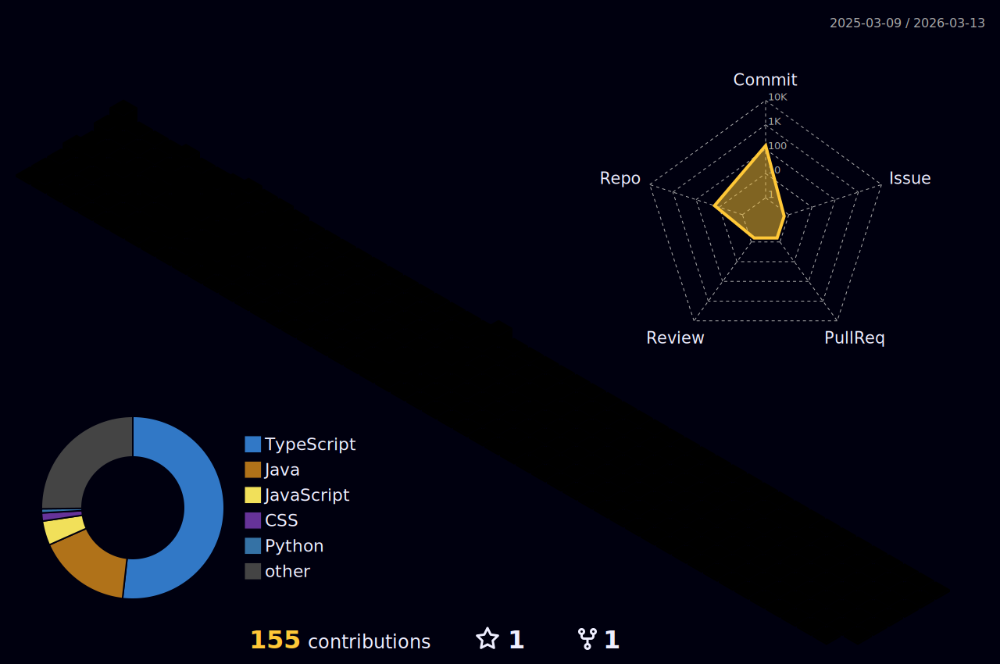

## 👋 About Me

Hi! I'm Vyctor, a 19-year-old student in my fourth semester of Systems Analysis and Development.

I'm passionate about backend development, with experience in **Java + Spring Boot**, **Node.js (TypeScript)**, and **Python**. I also enjoy building frontend interfaces using **React**, **JavaScript**, and **TypeScript**.

I'm familiar with **MySQL**, **PostgreSQL**, and **SQLite** databases, version control with **Git/GitHub**, and containerization with **Docker**.

Currently, I actively participate in academic extension projects as an instructor for programming logic, Java, and Object-Oriented Programming, where I share knowledge and continue to enhance my full-stack skills.

My focus is on growing as a software developer, delving deeper into architecture, clean code, and scalable solutions. Always learning, always coding!

---

  

---

## 📊 My GitHub Stats & Activity

| Productive Time (Common Commit Hours) | Profile Details                 |
| :------------------------------------: | :-----------------------------: |
|  |  |

 

  
  

 

  

 

  

---

## 🛠️ Skills & Tools

  

---

## 🧩 Featured Projects

| Project                                                        | Description                                                                                                                                                                                                                       | Technologies                                                     |
| -------------------------------------------------------------- | --------------------------------------------------------------------------------------------------------------------------------------------------------------------------------------------------------------------------------- | ------------------------------------------------------------------ |
| [📍 Trace Point - Interactive Portal](https://vyctor-carvalho.github.io/Trace_Point/) | Interactive portal and documentation for the Trace Point project. It presents the features of the COP-30 visitor management system, detailing frontend interactions with the API for different user profiles (Visitor, Organizer, Admin). | HTML, CSS, JavaScript                                              |
| [🚀 Fullstack Node](https://github.com/vyctor-carvalho/Full_Stack_Node) | Full-stack project developed as a technical test. Includes a Node.js + TypeScript API and two React frontends (Ant Design and Material UI). Uses Docker and Docker Compose.                                    | Node.js, TypeScript, React, Ant Design, Material UI, Docker      |
| [📚 Java Book API](https://github.com/vyctor-carvalho/Api-Livros-em-java) | First API project in Java, using Spring Boot and Java 21 for a book CRUD operation with database integration.                                                                                                   | Java 21, Spring Boot, MySQL                                        |
| [🌍 Angel Visitor API (Trace Point Backend)](https://github.com/vyctor-carvalho/cop30-guide) | REST API for COP-30, the backend for the Trace Point project. Allows 'Angels' to guide Visitors, manage event attendance, and control access with JWT and role-based permissions.                                   | Node.js, TypeScript, PostgreSQL                                    |
| [🐍 Django API ](https://github.com/vyctor-carvalho/Full_Stack_Python) | API built with Python and Django, using SQLite and custom JWT validation. Includes full CRUD functionality with user login and registration.                                                                      | Python, Django, SQLite                                             |
| [📊 Itaú Statistics API](https://github.com/vyctor-carvalho/Api-Transacoes-Itau) | REST API for a technical challenge, handling statistics and transaction control. Features endpoints for POST/DELETE and GET of transactions in the last minute. Uses Docker.                                    | Java, Spring Boot, Docker                                          |

---

## 📫 Contact

 
  
  

